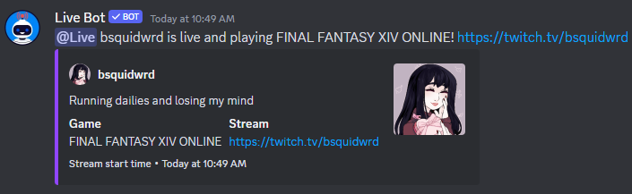

## Live Bot
  

## Running
[Click here to have the bot added to your server](https://livebot.bsquid.io/invite)

### Example notification

## Documentation
[Click here for documentation on the bot](https://bsquidwrd.gitbook.io/livebot-docs/)

## Thanks
- [ThatOhio](https://github.com/thatohio) and his patience with me while I learned C# and wrote this new version of the bot at the same time
- [BinaryDigit](https://github.com/BinaryDigitCodes) for making the avatar
